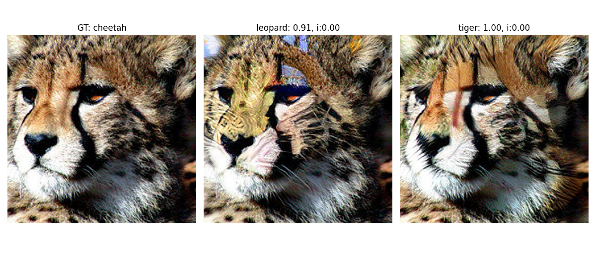
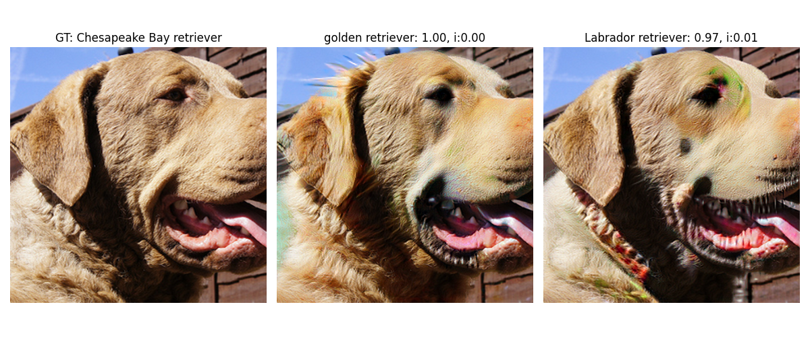
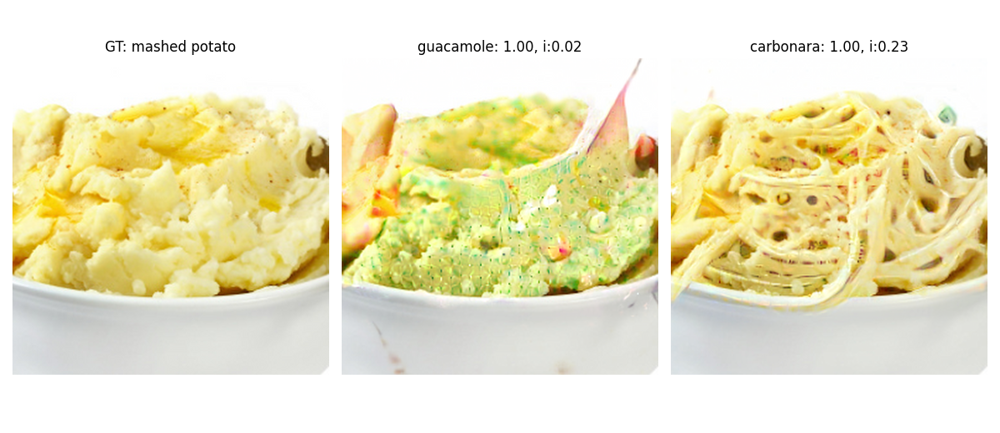
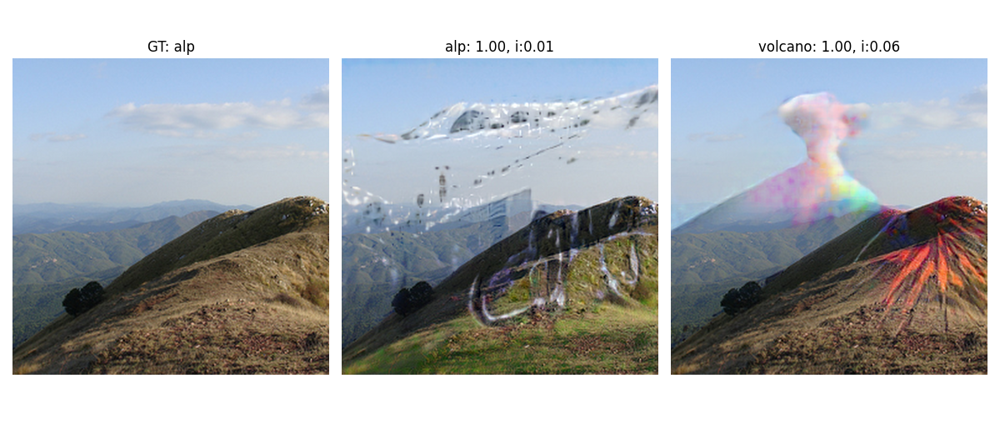
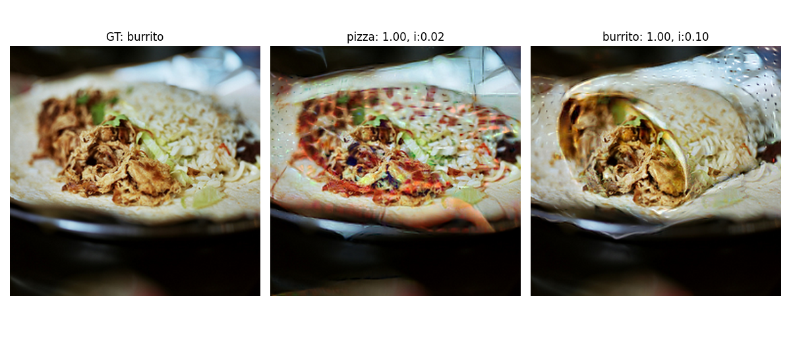
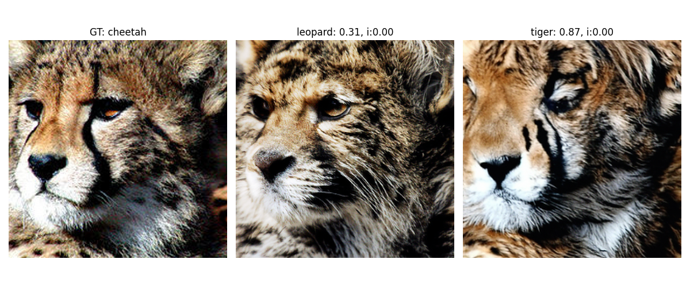
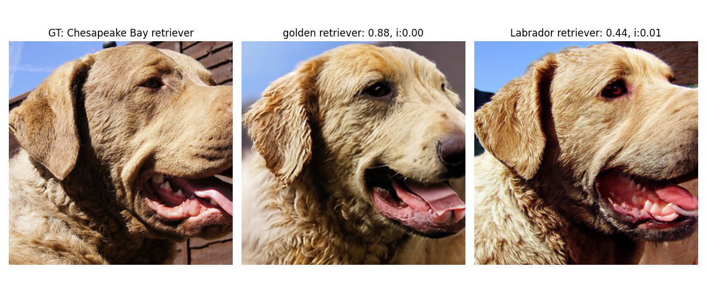
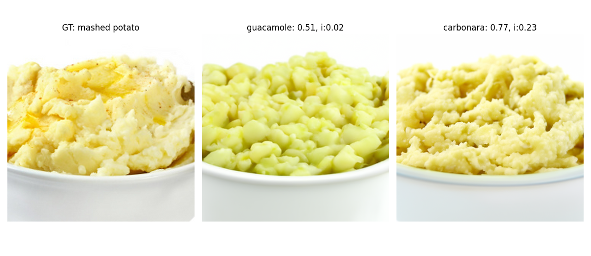
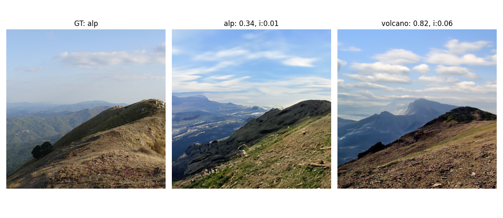
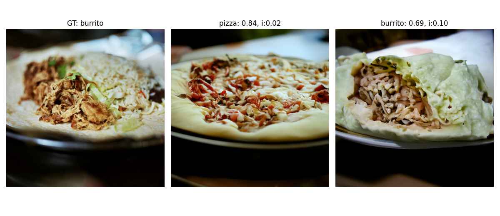

# **Diffusion Visual Counterfactual Explanations**

This page is to reproduce the results as stated in the NeurIPS paper *Diffusion Visual Counterfactual Explanations.* The steps to generate DVCEs on the selected (and you can choose the targets yourselves) ImageNet images with the multiple norm robust model Madry + FT and two SOTA **non-robust** models Swin-T and ConvNeXt is shown. 

## Examples of DVCEs without cone projection for Madry + FT

In the following, first image is the starting image, `GT` stands for the "ground-truth label", and the images in the second and third columns - are VCEs in the respective target classes displayed above. For each the achieved and the initial confidences (`i`) are displayed above.

<p align="center">
  
</p>
<p align="center">
  
</p>
<p align="center">
  
</p>
<p align="center">
  
</p>
<p align="center">
  
</p>

## Examples of DVCEs with the cone projection for Madry + FT and  the **non-robust** Swin-T classifier

In the following, first image is the starting image, `GT` stands for the "ground-truth label", and the images in the second and third columns - are VCEs in the respective target classes displayed above. For each the achieved and the initial confidences (`i`) are displayed above.

<p align="center">
  
</p>
<p align="center">
  
</p>
<p align="center">
  
</p>
<p align="center">
  
</p>
<p align="center">
  
</p>

## Examples of DVCEs with the cone projection for Madry + FT and  the **non-robust** ConvNeXt classifier

In the following, first image is the starting image, `GT` stands for the "ground-truth label", and the images in the second and third columns - are VCEs in the respective target classes displayed above. For each the achieved and the initial confidences (`i`) are displayed above.

<p align="center">
  
</p>
<p align="center">
  
</p>
<p align="center">
  
</p>
<p align="center">
  
</p>
<p align="center">
  
</p>

## Examples of SVCEs for Madry + FT

In the following, first image is the starting image, `GT` stands for the "ground-truth label", and the images in the second and third columns - are VCEs in the respective target classes displayed above. For each the achieved and the initial confidences (`i`) are displayed above.

<p align="center">
  
</p>
<p align="center">
  
</p>
<p align="center">
  
</p>
<p align="center">
  
</p>
<p align="center">
  
</p>

## Examples of blended diffusion based VCEs

In the following, first image is the starting image, `GT` stands for the "ground-truth label", and the images in the second and third columns - are VCEs in the respective target classes displayed above. For each the achieved and the initial confidences (`i`) are displayed above.

<p align="center">
  
</p>
<p align="center">
  
</p>
<p align="center">
  
</p>
<p align="center">
  
</p>
<p align="center">
  
</p>


## Setup

Before we can start with the generation, we have to setup the project and install required packages.

* Start by extracting the content of the .zip file that also contains this readme.md somewhere on your computer. We will refer to the extraction directory as **project_path**.
* Navigate into the  **project_path**

* Unzip the the weights for Madry + FT model file via `unzip MadryFT.zip` inside **project_path**

* Execute `mkdir checkpoints; cd checkpoints`
* and `wget https://openaipublic.blob.core.windows.net/diffusion/jul-2021/256x256_diffusion_uncond.pt`

* Navigate into the  **project_path**
* Inside folder 'scratch\datasets\imagenet', place the externally downloaded imagenet validation dataset (val) and ILSVRC2012_devkit_t12.tar.gz inside imagenet. you can download validation dataset with command `wget https://image-net.org/data/ILSVRC/2012/ILSVRC2012_img_val.tar --no-check-certificate` and ILSVRC2012_devkit_t12.tar.gz with command `wget https://image-net.org/data/ILSVRC/2012/ILSVRC2012_devkit_t12.tar.gz --no-check-certificate`

* Create a new conda env by executing the following commands `module load anaconda3/latest`,`$ANACONDA_HOME/etc/profile.d/conda.sh`, `conda env create -f environment_py_38.yml`
* Activate the conda environment via `conda activate environment_py_38`
* Install additionally robustbench via `pip install git+https://github.com/RobustBench/robustbench.git`

## Creating  DVCEs/SVCEs/blended diffusion based VCEs

In the following, we show, how to first set the parameters, and then - generate VCEs of the respective type for 6 selected targets. To choose your own image ids and targets, change `some_vces`, but consider targets that are semantically close to the original image, to ensure that meaningful explanations (VCEs) can be generated.

For any of the proposed parameter settings, feel free to adjust the values, but these are the ones we have used mostly in the paper.

* Generating DVCEs without cone projection for Madry + FT via
  `python imagenet_VCEs.py --num_imgs 12 --denoise_dist_input > logs/log`  

* Generating DVCEs with the cone projection for Madry + FT and respectively Swin-T (model id is 30) and ConvNeXt (model id is 31) via
  
  `python imagenet_VCEs.py --deg_cone_projection 30 --second_classifier_type 30 --num_imgs 12 --denoise_dist_input --aug_num 16 > logs/log`
  or
  `python imagenet_VCEs.py --deg_cone_projection 31 --second_classifier_type 30 --num_imgs 12 --denoise_dist_input --aug_num 16 > logs/log`

* Generating SVCEs for Madry + FT via
  `python imagenet_VCEs.py --num_imgs 12 --config 'svce.yml' > logs/log` 

* Generating blended diffusion based VCEs via
  `python imagenet_VCEs.py --num_imgs 12 --config 'blended.yml' --use_blended --background_preservation_loss > logs/log` 

The batchsize argument `--batch_size` is the number of samples per gpu, so if you encounter out-of-memory errors you can reduce it without altering results.

The resulting images can be found in `ImageNetVCEs/examples/`.

## Citation

If you find this useful in your research, please consider citing:

```bibtex
@inproceedings{Augustin2022Diffusion,
      title={Diffusion Visual Counterfactual Explanations},
      author={Maximilian Augustin and Valentyn Boreiko and  Francesco Croce  and Matthias Hein},
      booktitle={NeurIPS},
      year={2022}
}
